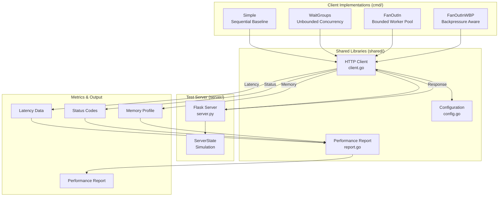
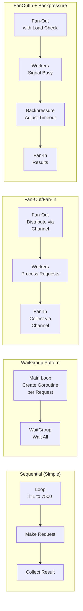
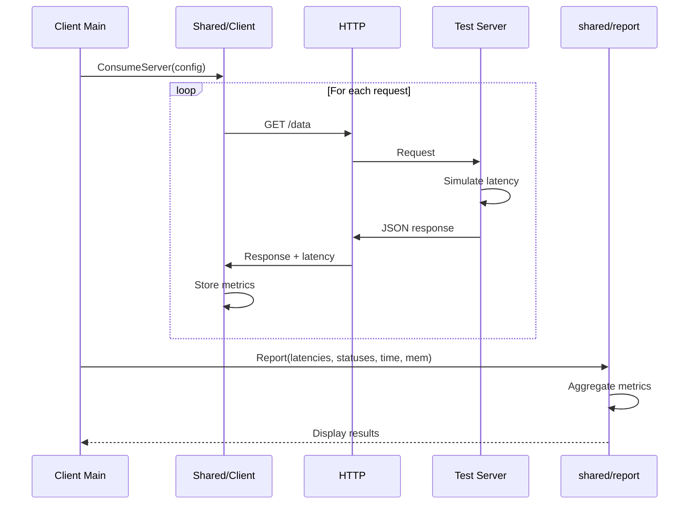
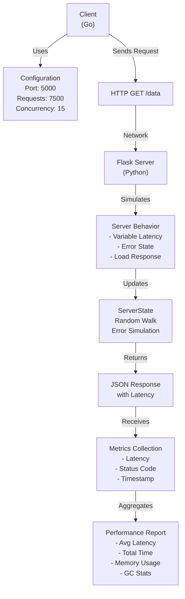
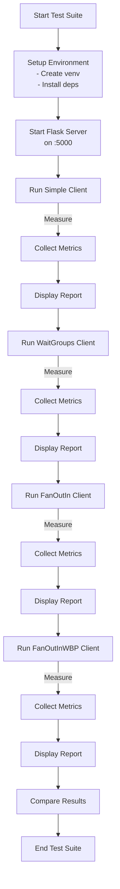

# Architecture Overview

## Project Structure

```
go-concurrency-patterns/
├── cmd/                              # Executable client implementations
│   ├── simple/main.go               # Sequential client (baseline)
│   ├── waitgroups/main.go           # WaitGroup-based concurrent client
│   ├── fanoutin/main.go             # Fan-out/Fan-in worker pool
│   └── fanoutinwbp/main.go          # Fan-out/Fan-in with backpressure
├── config/                           # Configuration management
│   └── config.go                    # Configuration struct and factories
├── shared/                           # Shared utilities
│   ├── client.go                    # HTTP client implementation
│   └── report.go                    # Performance reporting
├── server/                           # Test server (Python Flask)
│   ├── server.py                    # Flask server implementation
│   └── requirements.txt             # Python dependencies
└── docs/                             # Documentation
    ├── ARCHITECTURE.md              # This file
    ├── PATTERNS.md                  # Concurrency pattern details
    ├── API.md                       # Component API reference
    └── GETTING_STARTED.md           # Quick start guide
```

## Design Goals

1. **Educational:** Demonstrate real-world concurrency patterns with clear implementations
2. **Comparative:** Enable direct performance comparison between approaches
3. **Observable:** Measure and report detailed metrics (latency, throughput, memory)
4. **Extensible:** Easy to add new patterns or measurement approaches
5. **Realistic:** Test server simulates genuine server behavior with variable latency and errors

## System Architecture



## Concurrency Pattern Architecture



## Component Interaction Flow



## Request Flow Architecture



## System Components

### 1. Client Implementations (`cmd/`)

Four different client approaches for sending 7,500 HTTP requests to a test server:

- **Simple:** Sequential baseline
- **WaitGroups:** Unbounded goroutine concurrency
- **FanOutIn:** Bounded worker pool pattern
- **FanOutInWBP:** Worker pool with adaptive backpressure

Each client:
- Sends the same number of requests (7,500 by default)
- Measures individual request latencies
- Tracks HTTP status codes
- Profiles memory usage during execution

### 2. Configuration Module (`config/`)

Centralized configuration management with sensible defaults:

```go
type Config struct {
    Host        string  // Server host (e.g., "localhost")
    Port        int     // Server port (e.g., 5000)
    Requests    int     // Total requests to send
    Concurrency int     // Number of concurrent workers (worker pools only)
}
```

Functions:
- `NewConfig(host, port)`: Create custom configuration
- `GetDefaultConfig()`: Returns production defaults (7,500 requests, 15 concurrency)

### 3. Shared Utilities (`shared/`)

#### HTTP Client (`client.go`)
- Abstracts HTTP communication with the test server
- `ConsumeServer()` function makes individual requests and measures latency
- Handles error cases gracefully

#### Performance Reporting (`report.go`)
- Aggregates and displays metrics after execution
- Reports on:
  - Average latency
  - Total execution time
  - HTTP status code distribution
  - Memory allocation patterns
  - Garbage collection activity

### 4. Test Server (`server/`)

Python Flask server that simulates realistic server behavior:

- **Endpoint:** GET `/data` returns JSON response
- **Simulated Behavior:**
  - Variable latency (0-0.3 seconds) using random walk
  - Stochastic error simulation (~1% baseline error rate)
  - Dynamic error state based on request load
  - Latency scaling based on request frequency

**Key Feature:** ServerState class implements intelligent behavior simulation:
- Updates latency based on random walk
- Tracks error state probabilistically
- Adjusts behavior based on request spacing
- Provides realistic load testing environment

## Concurrency Patterns Overview

| Pattern | Goroutines | Synchronization | Memory | Use Case |
|---------|-----------|-----------------|--------|----------|
| Sequential | 0 | None | Low | Baseline reference |
| WaitGroups | 7,500 | sync.WaitGroup | High | Understanding overhead |
| FanOutIn | 15 | Channels | Medium | Resource-bounded work |
| FanOutInWBP | 15+ | Channels + signals | Medium | Adaptive load handling |

## Execution Flow Diagram



## Key Dependencies

### Go
- Standard library only:
  - `net/http` - HTTP client
  - `sync` - Synchronization primitives
  - `runtime` - Memory profiling
  - `time` - Timing operations

### Python (Server)
- Flask - Web framework
- python-dotenv - Environment configuration
- requests - HTTP library (for health checks)
- gunicorn - Production WSGI server

## Implementation Status

### Fully Implemented ✓
- Sequential client (simple/main.go)
- WaitGroup-based client (waitgroups/main.go)
- Fan-out/Fan-in pattern (fanoutin/main.go)
- Fan-out/Fan-in with backpressure (fanoutinwbp/main.go)
- HTTP client abstraction
- Performance reporting and metrics
- Configuration management
- Test server with realistic behavior simulation

### Planned (Listed in README)
- Pipelines pattern
- Rate limiter pattern
- Select statement demonstrations
- sync.Cond usage examples
- sync.Once usage examples
- context.Context integration

## Performance Characteristics

Each implementation is evaluated on:

1. **Speed:** Wall-clock time to complete all requests
2. **Memory Efficiency:** Total and peak memory usage
3. **CPU Utilization:** GC cycles and allocation patterns
4. **Latency Distribution:** Min, max, average response times
5. **Error Handling:** HTTP error code distribution

## Modularity and Extensibility

The codebase is designed for easy extension:

1. **New Patterns:** Add new `cmd/*/main.go` implementations
2. **New Metrics:** Extend `shared/report.go` for additional measurements
3. **Configuration:** Modify `config/config.go` for new parameters
4. **Server Behavior:** Adjust simulation in `server/server.py`

## Testing Strategy

Validation is performed through:
- Automated script execution (`simulate.sh`)
- Metrics collection and comparison
- Visual inspection of performance reports
- Server log analysis

This ensures reproducible, observable, and comparable results across pattern implementations.
