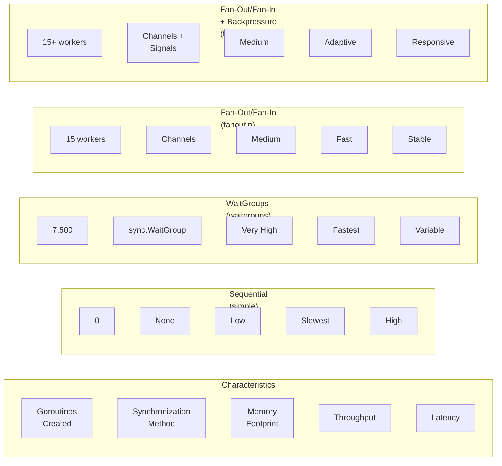
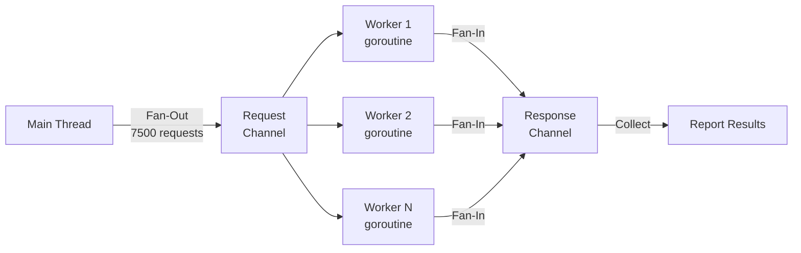
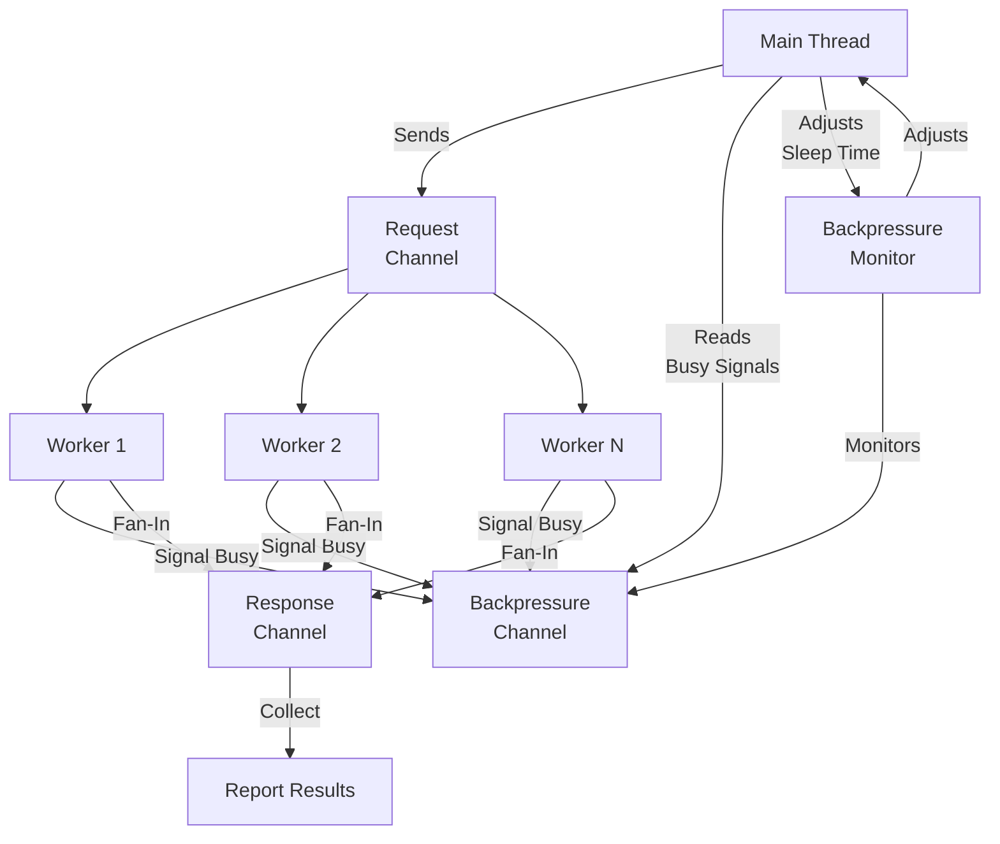
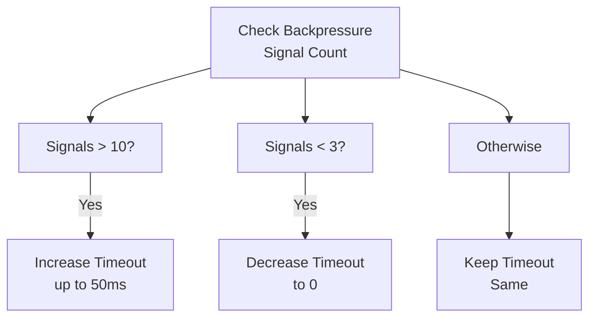
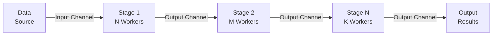

# Concurrency Patterns Guide

This document details each concurrency pattern implemented in the project with explanations, code flows, and use cases.

## Pattern Comparison Matrix



## 1. Sequential Pattern (simple)

### Overview
The sequential pattern is the baseline implementation that processes requests one at a time in a loop.

### Implementation
```go
for i := 0; i < cfg.Requests; i++ {
    latency, status := shared.ConsumeServer(cfg)
    latencies = append(latencies, latency)
    statuses = append(statuses, status)
}
```

### Characteristics
- **Goroutines:** 0 additional goroutines
- **Synchronization:** None required
- **Memory Usage:** Minimal
- **Execution Model:** Strictly sequential
- **Throughput:** Single request at a time

### Advantages
- ✓ Simplest to understand and debug
- ✓ No synchronization overhead
- ✓ Minimal memory consumption
- ✓ Perfect baseline for comparison

### Disadvantages
- ✗ Slowest overall execution time
- ✗ Poor utilization of network bandwidth
- ✗ No parallelism
- ✗ Blocking on network I/O

### Use Cases
- Establishing performance baselines
- Single-threaded systems
- Sequential workflows with dependencies
- When latency of individual requests is the priority

### Execution Timeline
```
Request 1  |====|
Request 2          |====|
Request 3                 |====|
Request 4                        |====|
```

---

## 2. WaitGroup Pattern (waitgroups)

### Overview
The WaitGroup pattern spawns a new goroutine for each request and uses `sync.WaitGroup` for synchronization.

### Implementation
```go
var wg sync.WaitGroup

for i := 0; i < cfg.Requests; i++ {
    wg.Add(1)
    go func() {
        defer wg.Done()
        latency, status := shared.ConsumeServer(cfg)
        latencies = append(latencies, latency)
        statuses = append(statuses, status)
    }()
}

wg.Wait()
```

### Key Components
- **sync.WaitGroup:** Ensures all goroutines complete before reporting
- **Goroutines:** One per request (7,500 total)
- **Channels:** None used
- **Synchronization Point:** Single WaitGroup.Wait()

### Characteristics
- **Goroutines:** 7,500 (one per request)
- **Synchronization:** sync.WaitGroup
- **Memory Usage:** Very high (7,500 goroutine stacks)
- **Concurrency:** Unbounded
- **Throughput:** High

### Advantages
- ✓ High concurrency without limiting
- ✓ Fast execution time
- ✓ Simple to implement
- ✓ Good for I/O bound tasks
- ✓ Demonstrates goroutine creation

### Disadvantages
- ✗ Memory intensive (7,500 goroutine stacks)
- ✗ GC overhead due to many allocations
- ✗ No backpressure control
- ✗ Potential goroutine scheduling overhead
- ✗ No resource limits

### Use Cases
- I/O-bound operations with bounded request count
- Systems with sufficient memory
- Quick and dirty concurrent solutions
- Testing goroutine limits

### Memory Considerations
Each goroutine in Go consumes approximately 2-3KB of memory on the stack. With 7,500 goroutines:
```
7,500 goroutines × 2.5KB/goroutine = ~18-20MB just for stacks
```

### Execution Timeline
```
Request 1  |====|
Request 2  |====|
Request 3  |====|
Request 4  |====|
... 7,500 total in parallel
```

---

## 3. Fan-Out/Fan-In Pattern (fanoutin)

### Overview
The Fan-Out/Fan-In pattern uses a fixed number of worker goroutines that process requests from a channel, implementing a bounded worker pool.

### Architecture


### Implementation
```go
requestChan := make(chan int, 100)
responseChan := make(chan Response, 100)

// Start workers
for i := 0; i < cfg.Concurrency; i++ {
    go func() {
        for range requestChan {
            latency, status := shared.ConsumeServer(cfg)
            responseChan <- Response{latency, status}
        }
    }()
}

// Fan-out: send requests
go func() {
    for i := 0; i < cfg.Requests; i++ {
        requestChan <- i
    }
    close(requestChan)
}()

// Fan-in: collect responses
for i := 0; i < cfg.Requests; i++ {
    resp := <-responseChan
    latencies = append(latencies, resp.Latency)
    statuses = append(statuses, resp.Status)
}
```

### Key Components
- **Worker Pool:** Fixed number of goroutines (default: 15)
- **Request Channel:** Buffered channel for distributing work
- **Response Channel:** Buffered channel for collecting results
- **Fan-Out:** Main thread distributes 7,500 requests
- **Fan-In:** Main thread collects all responses

### Characteristics
- **Goroutines:** 15 workers + 1 fan-out goroutine
- **Channels:** 2 (request and response)
- **Memory Usage:** Medium (fixed number of goroutines)
- **Concurrency:** Bounded to 15 parallel requests
- **Throughput:** Balanced

### Channel Configuration
- **Request Channel Buffer:** 100 (prevents blocking on send)
- **Response Channel Buffer:** 100 (prevents blocking on receive)

### Advantages
- ✓ Bounded resource usage
- ✓ Controlled concurrency level
- ✓ Memory efficient compared to WaitGroup
- ✓ Better server load management
- ✓ Scales to any number of requests
- ✓ Good balance of throughput and resources

### Disadvantages
- ✗ Requires channel coordination
- ✗ More complex than sequential or WaitGroup
- ✗ No dynamic adaptation to load
- ✗ Fixed worker count (not optimal for all scenarios)

### Use Cases
- Production systems with resource constraints
- Managing load on downstream services
- Batch processing with worker pools
- Systems requiring predictable resource usage
- API clients with rate limiting needs

### Execution Timeline
```
Worker 1: Request 1 |====| Request 16 |====| ...
Worker 2: Request 2 |====| Request 17 |====| ...
...
Worker 15: Request 15 |====| Request 30 |====| ...
```

### Performance Characteristics
- Throughput: `15 concurrent × average_latency = total_time`
- Memory: Fixed overhead regardless of request count
- Scalability: Linear with request count, constant with worker count

---

## 4. Fan-Out/Fan-In with Backpressure (fanoutinwbp)

### Overview
An advanced variant of the Fan-Out/Fan-In pattern that adds adaptive backpressure signaling, allowing the system to dynamically adjust request rate based on worker load.

### Architecture


### Implementation
```go
backpressureChan := make(chan struct{}, 1000)

// Worker with backpressure signaling
go func() {
    for i := range requestChan {
        select {
        case backpressureChan <- struct{}{}:
            // Signal we're busy
        default:
        }
        latency, status := shared.ConsumeServer(cfg)
        responseChan <- Response{latency, status}
        <-backpressureChan  // Signal we're done
    }
}()

// Backpressure monitor
go func() {
    ticker := time.NewTicker(100 * time.Millisecond)
    for range ticker.C {
        pressure := len(backpressureChan)
        if pressure > 10 {
            timeout = min(timeout+5*time.Millisecond, 50*time.Millisecond)
        } else if pressure < 3 {
            timeout = 0
        }
    }
}()

// Fan-out with adaptive delay
for i := 0; i < cfg.Requests; i++ {
    time.Sleep(timeout)  // Dynamic backoff
    requestChan <- i
}
```

### Key Components
- **Backpressure Channel:** Signals when workers are busy (non-blocking)
- **Backpressure Monitor:** Goroutine that analyzes pressure every 100ms
- **Adaptive Timeout:** Sleep duration adjusted based on load
- **Worker Pool:** 15 workers with backpressure signaling

### Backpressure Logic


### Characteristics
- **Goroutines:** 15 workers + 1 fan-out + 1 monitor = 17 total
- **Channels:** 3 (request, response, backpressure)
- **Memory Usage:** Medium
- **Concurrency:** Bounded to 15 workers
- **Adaptation:** Dynamic timeout adjustment (0-50ms)
- **Throughput:** Adaptive based on server load

### Timeout Adjustment Strategy
- **High Pressure (>10 signals):** Increase sleep by 5ms up to 50ms max
- **Low Pressure (<3 signals):** Reset sleep to 0ms
- **Monitor Interval:** 100ms (sample every 100ms)
- **Cooling Mechanism:** Prevents overwhelming the server

### Advantages
- ✓ Adaptive response to server load
- ✓ Prevents server overload
- ✓ Better resource utilization than fixed concurrency
- ✓ Demonstrates advanced backpressure patterns
- ✓ Self-regulating throughput
- ✓ Protective for downstream systems

### Disadvantages
- ✗ Most complex implementation
- ✗ Multiple goroutines and channels
- ✗ Requires tuning of backpressure thresholds
- ✗ Non-deterministic behavior (depends on server state)
- ✗ Overhead of monitoring and signaling

### Use Cases
- Production API clients talking to shared services
- Protecting overloaded servers
- Adaptive load management
- Systems that must self-regulate
- Long-running services with variable load
- Distributed systems with upstream/downstream dependencies

### Performance Characteristics
- **Latency Stability:** Highest (adapts to maintain balanced load)
- **Throughput Variance:** Lowest (self-regulating)
- **Server Protection:** Best (prevents overwhelming)
- **Resource Predictability:** High (bounded workers + adaptive timeouts)

### Execution Timeline (Variable)
```
Server Load: LOW
Worker 1: Request 1 |=| Request 16 |=| ...  (fast pace)

Server Load: HIGH
Worker 1: Request 1 |====| Request 16 |====| ... (slow pace, sleeping between requests)
```

---

## Pattern Selection Guide

### Choose Sequential When:
- You need a performance baseline
- Requests must be processed in order
- System has minimal resources
- Debugging is your priority

### Choose WaitGroup When:
- Maximum throughput is critical
- System has abundant memory
- Request order doesn't matter
- Learning about goroutines

### Choose Fan-Out/Fan-In When:
- You need predictable resource usage
- Operating in production
- Server capacity is limited
- Simple bounded concurrency is sufficient

### Choose Fan-Out/Fan-In + Backpressure When:
- Server is shared/overloaded
- Need to protect downstream systems
- Want adaptive load management
- System must be self-regulating
- Running long-lived services

## 5. Pipelines Pattern

### Overview
The Pipelines pattern enables multi-stage concurrent data processing workflows. Each stage operates independently with its own worker pool, allowing efficient transformation of data through sequential stages with bounded resource usage.

### Architecture


### Implementation
```go
// Message wraps data with metadata
type Message[T any] struct {
    ID      int64
    Payload T
}

// Stage defines a processing stage with workers
type Stage[I any, O any] struct {
    Name     string
    Workers  int
    Buffer   int
    Function func(Message[I]) (Message[O], error)
}

// Example: Pipeline with type transformations
input := make(chan Message[int])

squareStage := Stage[int, int]{
    Workers: 3,
    Buffer:  4,
    Function: func(msg Message[int]) (Message[int], error) {
        return Message[int]{ID: msg.ID, Payload: msg.Payload * msg.Payload}, nil
    },
}

doubleStage := Stage[int, int]{
    Workers: 2,
    Buffer:  4,
    Function: func(msg Message[int]) (Message[int], error) {
        return Message[int]{ID: msg.ID, Payload: msg.Payload * 2}, nil
    },
}

// Wire stages together
out1, g1 := squareStage.Run(ctx, input)
out2, g2 := doubleStage.Run(ctx, out1)

// Wait for completion
go func() {
    _ = g1.Wait()
    _ = g2.Wait()
}()

// Consume results
for result := range out2 {
    fmt.Printf("[%d]: %d\n", result.ID, result.Payload)
}
```

### Key Components
- **Message[T]:** Generic message wrapper with ID and payload
- **Stage[I,O]:** Type-safe processing stage with input/output types
- **Workers:** Bounded worker pool per stage (default: configurable)
- **Run():** Executes stage, returns output channel and error group
- **Composition:** Chainable stages for multi-step pipelines

### Characteristics
- **Goroutines:** W₁ + W₂ + ... + Wₙ (bounded to sum of all workers)
- **Channels:** Multiple (one per stage boundary)
- **Memory Usage:** Low (fixed number of goroutines)
- **Concurrency:** Bounded per stage
- **Type Safety:** Full generic type checking

### Advantages
- ✓ Type-safe transformations with generics
- ✓ Excellent memory efficiency (bounded goroutines)
- ✓ Composable and chainable stages
- ✓ Independent stage configuration
- ✓ Perfect for large dataset processing
- ✓ Scalable to many requests
- ✓ Context-aware cancellation

### Disadvantages
- ✗ More complex setup than WaitGroup
- ✗ Requires understanding of generics
- ✗ Per-stage configuration overhead
- ✗ Bottleneck stage limits throughput

### Use Cases
- ETL (Extract, Transform, Load) pipelines
- Stream processing with multiple transformations
- Batch processing with sequential stages
- Log processing and analysis
- Image/media processing pipelines
- Data validation and enrichment workflows

### Execution Timeline
```
Input: 1..10
Stage 1 (Square, 3 workers):
  W1: [1→1] [4→16] [7→49]  ...
  W2: [2→4] [5→25] [8→64]  ...
  W3: [3→9] [6→36] [9→81]  ...

Stage 2 (Double, 2 workers):
  W1: [1→2] [4→8] [7→14]   ...
  W2: [9→18] [25→50] [36→72] ...

Output: [1]:2, [2]:8, [3]:18, [4]:32, ...
```

### Performance Characteristics
- **Throughput:** Limited by slowest stage (bottleneck)
- **Latency:** Sum of all stage latencies
- **Memory:** O(total_workers × goroutine_stack_size)
- **Scalability:** Linear with message count, constant with worker count

---

## Concurrency Primitives Used

| Pattern | WaitGroup | Channels | Goroutines | Mutex | Context | Generics |
|---------|-----------|----------|-----------|-------|---------|----------|
| Sequential | ✗ | ✗ | ✗ | ✗ | ✗ | ✗ |
| WaitGroup | ✓ | ✗ | ✓ | ✗ | ✗ | ✗ |
| FanOutIn | ✗ | ✓ | ✓ | ✗ | ✗ | ✗ |
| FanOutInWBP | ✗ | ✓ | ✓ | ✗ | ✗ | ✗ |
| Pipelines | ✗ | ✓ | ✓ | ✗ | ✓ | ✓ |

## Performance Metrics Comparison

All patterns are measured with:
- **Request Count:** 7,500
- **Server Endpoint:** GET /data
- **Default Workers:** 15 (for patterns supporting it)
- **Metrics Collected:**
  - Total execution time
  - Individual request latencies
  - Memory allocation and GC activity
  - HTTP status codes

Expected relative performance on typical systems:
```
Pattern              Time    Memory   Throughput
Sequential           100%    100%     100%
WaitGroup            20%     400%     500%
FanOutIn             25%     150%     400%
FanOutInWBP          30%     150%     350%
```

(Note: Actual values depend on server capacity, network conditions, and system resources)
