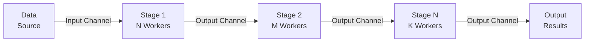

# Pipelines Pattern

## Overview

The Pipelines pattern is a powerful concurrency pattern for building multi-stage data processing workflows. It allows you to compose independent, concurrent stages that transform data as it flows through them. Each stage operates with its own worker pool, enabling efficient processing of large datasets with bounded resource usage.

This pattern is commonly used in:
- **ETL (Extract, Transform, Load) operations**
- **Stream processing systems**
- **Multi-stage data transformations**
- **Real-time event processing pipelines**
- **Batch processing workflows**

## Architecture

### High-Level Diagram



### Example Pipeline Flow

```
Input (1..10)
    ↓
[Square Stage - 3 workers] → transforms x to x²
    ↓
[Double Stage - 2 workers] → transforms x to x*2
    ↓
Output (2, 8, 18, 32, 50, ...)
```

## Core Components

### 1. Message Type

```go
type Message[T any] struct {
    ID      int64  // Unique identifier for tracking
    Payload T      // Generic type-safe data
}
```

**Purpose:** Wraps data flowing through the pipeline with metadata (ID) for tracking and correlation.

**Generic Type Parameter `T`:**
- Can be any Go type: `int`, `string`, `struct`, etc.
- Type-checked at compile time
- Example: `Message[int]`, `Message[User]`, `Message[[]float64]`

### 2. Stage Type

```go
type Stage[I any, O any] struct {
    Name     string                                  // Stage identifier
    Workers  int                                     // Number of concurrent workers
    Buffer   int                                     // Channel buffer size
    Function func(Message[I]) (Message[O], error)   // Transformation function
}
```

**Type Parameters:**
- `I` - Input type (what this stage consumes)
- `O` - Output type (what this stage produces)

**Fields:**
- **Name:** Human-readable identifier for logging and debugging
- **Workers:** Number of concurrent goroutines processing messages
- **Buffer:** Buffered channel size for flow control (prevents deadlocks)
- **Function:** User-defined transformation function

**Key Capability:** Allows type transformations (e.g., `Stage[int, string]` converts integers to strings)

### 3. Stage.Run() Method

```go
func (s *Stage[I, O]) Run(ctx context.Context, input <-chan Message[I])
    (<-chan Message[O], *errgroup.Group)
```

**Purpose:** Executes the stage with concurrent workers.

**Parameters:**
- `ctx context.Context` - For cancellation and deadline support
- `input <-chan Message[I]` - Input channel (read-only)

**Returns:**
- `<-chan Message[O]` - Output channel for downstream stages
- `*errgroup.Group` - For managing worker goroutines and errors

**Implementation Details:**
1. Creates output channel with configured buffer size
2. Spawns N worker goroutines (where N = `Workers`)
3. Each worker:
   - Reads messages from input channel
   - Applies transformation function
   - Respects context cancellation
   - Sends results to output channel
4. Automatically closes output channel when all workers complete
5. Error group collects errors from any worker failures

## Concurrency Model

### Worker Pool Pattern

Each stage implements a bounded worker pool:

```
┌─────────────────────────────────────────┐
│         Stage with N Workers            │
├─────────────────────────────────────────┤
│                                         │
│  Input Channel                          │
│        ↓                                │
│    ┌───────────────────┐               │
│    │  Work Queue       │               │
│    └───────────────────┘               │
│        ↓   ↓   ↓                       │
│    [W1] [W2] [W3] ... [WN]            │
│        ↓   ↓   ↓                       │
│    ┌───────────────────┐               │
│    │ Output Channel    │               │
│    └───────────────────┘               │
│        ↓                                │
│  (to next stage or output)             │
│                                         │
└─────────────────────────────────────────┘
```

**Characteristics:**
- Fixed number of workers per stage
- Buffered channels decouple producer/consumer speeds
- Workers operate independently and concurrently
- Automatic load distribution across workers

## Usage Guide

### Basic Example

```go
package main

import (
    "context"
    "fmt"
    "github.com/aawadall/go-concurrency-patterns/cmd/pipelines/pipeline"
)

func main() {
    ctx := context.Background()

    // Create input channel
    input := make(chan pipeline.Message[int])

    // Generate data
    go func() {
        for i := 1; i <= 10; i++ {
            input <- pipeline.Message[int]{
                ID:      int64(i),
                Payload: i,
            }
        }
        close(input)
    }()

    // Define transformation stages
    squareStage := pipeline.Stage[int, int]{
        Name:    "Square",
        Workers: 3,
        Buffer:  4,
        Function: func(msg pipeline.Message[int]) (pipeline.Message[int], error) {
            return pipeline.Message[int]{
                ID:      msg.ID,
                Payload: msg.Payload * msg.Payload,
            }, nil
        },
    }

    doubleStage := pipeline.Stage[int, int]{
        Name:    "Double",
        Workers: 2,
        Buffer:  4,
        Function: func(msg pipeline.Message[int]) (pipeline.Message[int], error) {
            return pipeline.Message[int]{
                ID:      msg.ID,
                Payload: msg.Payload * 2,
            }, nil
        },
    }

    // Build pipeline
    out1, g1 := squareStage.Run(ctx, input)
    out2, g2 := doubleStage.Run(ctx, out1)

    // Wait for completion
    go func() {
        _ = g1.Wait()
        _ = g2.Wait()
    }()

    // Consume results
    for result := range out2 {
        fmt.Printf("[%d]: %d\n", result.ID, result.Payload)
    }
}
```

**Output:**
```
[1]: 2
[2]: 8
[3]: 18
[4]: 32
[5]: 50
[6]: 72
[7]: 98
[8]: 128
[9]: 162
[10]: 200
```

### Advanced: Type-Safe Transformations

```go
// Transform int to string
type User struct {
    ID   int
    Name string
}

// Pipeline: int → User → string
parseStage := pipeline.Stage[int, User]{
    Name:    "Parse",
    Workers: 4,
    Buffer:  10,
    Function: func(msg pipeline.Message[int]) (pipeline.Message[User], error) {
        return pipeline.Message[User]{
            ID: msg.ID,
            Payload: User{
                ID:   msg.Payload,
                Name: fmt.Sprintf("User-%d", msg.Payload),
            },
        }, nil
    },
}

formatStage := pipeline.Stage[User, string]{
    Name:    "Format",
    Workers: 2,
    Buffer:  10,
    Function: func(msg pipeline.Message[User]) (pipeline.Message[string], error) {
        return pipeline.Message[string]{
            ID:      msg.ID,
            Payload: fmt.Sprintf("[%d] %s", msg.Payload.ID, msg.Payload.Name),
        }, nil
    },
}

// Wire: int → User → string
output1, g1 := parseStage.Run(ctx, intInput)
output2, g2 := formatStage.Run(ctx, output1)
```

### Error Handling

```go
stage := pipeline.Stage[int, int]{
    Name:    "WithErrors",
    Workers: 3,
    Buffer:  4,
    Function: func(msg pipeline.Message[int]) (pipeline.Message[int], error) {
        if msg.Payload < 0 {
            return pipeline.Message[int]{}, fmt.Errorf("negative value: %d", msg.Payload)
        }
        return pipeline.Message[int]{
            ID:      msg.ID,
            Payload: msg.Payload * 2,
        }, nil
    },
}

output, eg := stage.Run(ctx, input)

// Process results
for result := range output {
    fmt.Printf("Result: %d\n", result.Payload)
}

// Check for errors
if err := eg.Wait(); err != nil {
    fmt.Printf("Pipeline error: %v\n", err)
}
```

### Context-Based Cancellation

```go
ctx, cancel := context.WithTimeout(context.Background(), 5*time.Second)
defer cancel()

stage := pipeline.Stage[int, int]{
    Name:    "SlowStage",
    Workers: 2,
    Buffer:  4,
    Function: func(msg pipeline.Message[int]) (pipeline.Message[int], error) {
        time.Sleep(100 * time.Millisecond)  // Simulate work
        return msg, nil
    },
}

output, eg := stage.Run(ctx, input)

// If input stream takes > 5 seconds, context cancellation stops processing
for result := range output {
    fmt.Printf("Result: %d\n", result.Payload)
}
```

## Performance Characteristics

### Throughput Formula

For a pipeline with N stages, each with W workers:

```
Throughput = min(W₁, W₂, ..., Wₙ) × average_processing_time⁻¹

The bottleneck stage determines overall throughput.
```

### Memory Usage

```
Total Goroutines = W₁ + W₂ + ... + Wₙ
Each goroutine stack ≈ 2-3 KB
Total Stack Memory = Total Goroutines × 2-3 KB
```

### Example: 3 Stages with [4, 2, 3] Workers

```
Stage 1: 4 workers
Stage 2: 2 workers (BOTTLENECK)
Stage 3: 3 workers

Total Goroutines: 4 + 2 + 3 = 9
Stack Memory: 9 × 2.5 KB ≈ 22.5 KB (very efficient!)
Throughput Limited By: Stage 2
```

### Latency Characteristics

- **Per-message latency:** Sum of individual stage latencies
- **Pipeline latency:** Depends on slowest stage
- **Streaming latency:** First message latency + subsequent batching

## Configuration Best Practices

### Worker Count

**Guidelines:**
- **I/O-bound tasks:** `Workers = 2-4 × CPU cores` (high concurrency helps with I/O wait)
- **CPU-bound tasks:** `Workers = CPU cores` (additional workers waste context-switching)
- **Mixed workloads:** Start with `Workers = CPU cores`, adjust based on metrics

**Example for 8-core system:**
- Database queries: 16-32 workers
- CPU processing: 8 workers
- Network calls: 16-24 workers

### Buffer Size

**Guidelines:**
- **Small buffer (1-4):** Low latency, risk of blocking
- **Medium buffer (10-100):** Balanced, recommended for most cases
- **Large buffer (1000+):** High throughput, increased memory

**Trade-offs:**
```
Smaller Buffer     Medium Buffer      Larger Buffer
│                  │                   │
└─ Low latency    └─ Balanced         └─ High throughput
  High blocking      Recommended       Memory overhead
  Tight coupling     Flow control      Decoupled stages
```

### Stage Ordering

Arrange stages from slowest to fastest for optimal throughput:

**Bad:**
```
Fast Stage → Slow Stage → Fast Stage
(bottleneck in the middle)
```

**Good:**
```
Slow Stage → Medium Stage → Fast Stage
(bottleneck at the beginning)
```

## Real-World Use Cases

### 1. Log Processing Pipeline

```go
type LogEntry struct {
    Timestamp time.Time
    Level     string
    Message   string
}

type ParsedLog struct {
    Timestamp time.Time
    Level     string
    Message   string
    Parsed    map[string]interface{}
}

// Stage 1: Parse raw logs (many workers, I/O heavy)
parseStage := pipeline.Stage[string, ParsedLog]{
    Workers: 8,
    Buffer:  100,
    // ...
}

// Stage 2: Enrich with metadata (moderate workers)
enrichStage := pipeline.Stage[ParsedLog, ParsedLog]{
    Workers: 4,
    Buffer:  50,
    // ...
}

// Stage 3: Filter and deduplicate (fewer workers, compute heavy)
filterStage := pipeline.Stage[ParsedLog, ParsedLog]{
    Workers: 2,
    Buffer:  20,
    // ...
}
```

### 2. Image Processing Pipeline

```go
type ImageData struct {
    ID    string
    Bytes []byte
}

type ProcessedImage struct {
    ID    string
    Image image.Image
}

// Load images from disk
loadStage := pipeline.Stage[string, ImageData]{
    Workers: 4,  // I/O bound
    Buffer:  20,
    // ...
}

// Decode images
decodeStage := pipeline.Stage[ImageData, ProcessedImage]{
    Workers: 8,  // CPU bound
    Buffer:  30,
    // ...
}

// Apply filters
filterStage := pipeline.Stage[ProcessedImage, ProcessedImage]{
    Workers: 8,  // CPU bound
    Buffer:  30,
    // ...
}

// Save processed images
saveStage := pipeline.Stage[ProcessedImage, string]{
    Workers: 4,  // I/O bound
    Buffer:  20,
    // ...
}
```

### 3. Data Processing Pipeline

```go
type RawData struct {
    ID    int64
    Value interface{}
}

type ValidatedData struct {
    ID    int64
    Value interface{}
}

type AggregatedData struct {
    ID     int64
    Sum    float64
    Count  int
    Avg    float64
}

// Validate data
validateStage := pipeline.Stage[RawData, ValidatedData]{
    Workers: 8,
    Buffer:  100,
    // ...
}

// Aggregate metrics
aggregateStage := pipeline.Stage[ValidatedData, AggregatedData]{
    Workers: 4,
    Buffer:  50,
    // ...
}

// Store results
storeStage := pipeline.Stage[AggregatedData, string]{
    Workers: 2,
    Buffer:  10,
    // ...
}
```

## Advantages vs Other Patterns

### Pipelines vs WaitGroup

| Feature | Pipelines | WaitGroup |
|---------|-----------|-----------|
| Resource Control | Bounded workers | Unbounded |
| Memory Efficiency | High (fixed goroutines) | Low (one per task) |
| Type Safety | Type-safe transformation | Requires manual casting |
| Complexity | Moderate | Simple |
| Scalability | Excellent (fixed memory) | Limited (linear with tasks) |
| Use Case | Large datasets, multi-stage | Simple concurrency |

### Pipelines vs Fan-Out/Fan-In

| Feature | Pipelines | Fan-Out/Fan-In |
|---------|-----------|----------------|
| Multi-stage | Native support | Manual coordination |
| Type Transformation | Built-in (generics) | Manual conversion |
| Composition | Chainable | Requires explicit wiring |
| Flexibility | High (per-stage config) | Medium (single pool config) |
| Learning Curve | Moderate | Low |

## Troubleshooting

### Symptom: Pipeline stalls/deadlock

**Causes:**
- Channel buffer too small
- Closing input channel too early
- Not consuming output channel

**Solutions:**
```go
// ✓ Increase buffer size
stage := pipeline.Stage[int, int]{
    Buffer: 100,  // Increase from 4
    // ...
}

// ✓ Ensure you consume the output
for result := range output {
    // Process result
}

// ✓ Wait for goroutines properly
if err := eg.Wait(); err != nil {
    log.Fatal(err)
}
```

### Symptom: Slow throughput

**Causes:**
- Insufficient workers
- Bottleneck in a stage
- Buffer too small

**Solutions:**
```go
// ✓ Add more workers to slow stage
slowStage := pipeline.Stage[int, int]{
    Workers: 8,  // Increase from 2
    // ...
}

// ✓ Increase buffer to prevent blocking
stage := pipeline.Stage[int, int]{
    Buffer: 100,  // Increase buffer
    // ...
}

// ✓ Reorder stages (slowest first)
// Put slower stages earlier in pipeline
```

### Symptom: High memory usage

**Causes:**
- Too many workers
- Oversized buffers
- Memory leak in transformation function

**Solutions:**
```go
// ✓ Reduce worker count
stage := pipeline.Stage[int, int]{
    Workers: 2,  // Reduce from 8
    // ...
}

// ✓ Reduce buffer size
stage := pipeline.Stage[int, int]{
    Buffer: 10,  // Reduce from 1000
    // ...
}

// ✓ Check transformation function for memory leaks
Function: func(msg pipeline.Message[int]) (pipeline.Message[int], error) {
    // Don't accumulate data in closure
    // Don't allocate unnecessarily
    return msg, nil
}
```

## Dependencies

The pipelines implementation uses:
- **golang.org/x/sync/errgroup** (v0.17.0+) - For goroutine synchronization
- **context** (stdlib) - For cancellation and deadlines
- **Go 1.18+** - Requires generics support

## File Structure

```
cmd/pipelines/
├── main.go              # Example demonstration
└── pipeline/
    ├── message.go       # Message[T] type
    └── stage.go         # Stage[I,O] type and Run method
```

## See Also

- [PATTERNS.md](./PATTERNS.md) - Overview of all patterns
- [API.md](./API.md) - Detailed API reference
- [BENCHMARKS.md](./BENCHMARKS.md) - Performance comparison data
- [ARCHITECTURE.md](./ARCHITECTURE.md) - Project structure overview

## Examples

The `/cmd/pipelines/main.go` file contains a runnable example that demonstrates:
1. Creating input data
2. Defining multi-stage pipeline
3. Running stages concurrently
4. Consuming and displaying results

Run the example:
```bash
go run ./cmd/pipelines/main.go
```

## Further Reading

- [Go Concurrency Patterns Talk](https://go.dev/blog/pipelines) - Official Go blog
- [Advanced Go Concurrency Patterns](https://go.dev/blog/pipelines) - Go blog continuation
- [Concurrency in Go](https://pragprog.com/titles/kdgo/concurrency-in-go/) - Book by Katherine Cox-Buday
